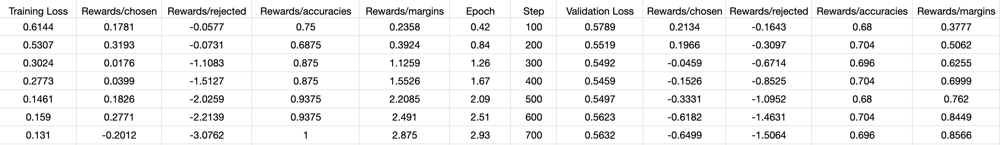
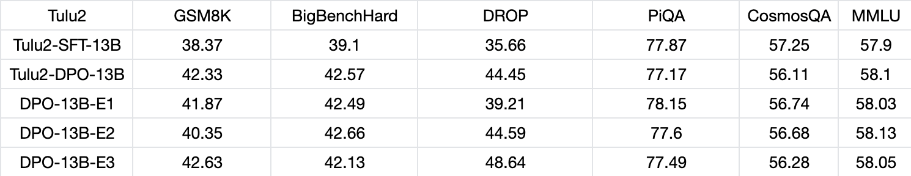

# LLM_DPO
General DPO scripts for LLMs.

## Environment
We provide [core_requirement.txt](core_requirement.txt) for your convenience.

## Settings
We tested with [tulu2 models](https://huggingface.co/collections/allenai/tulu-v2-suite-6551b56e743e6349aab45101), [Llama2 models](https://huggingface.co/meta-llama), [Qwen models](https://huggingface.co/Qwen)(1.0 version not 1.5) and [Baichuan2 Models](https://huggingface.co/baichuan-inc) with up to 100k instructions. Our environment is 900G CPU RAM and 8 x A800 80G GPUs for every computing node. We use [flashattention2](https://github.com/Dao-AILab/flash-attention) and [deepspeed](https://github.com/microsoft/DeepSpeed/tree/master) for faster training.

## Workflow
`RootPath` is the absolute path of this repo.

### Instruction Tuning
Download raw models in [model](model) folder. Put your data in [data](data) folder. Run `bash code/scripts/tuning.sh 0 sigmoid RootPath`. 0 at $1 stands for full tuning, and sigmoid at $2 stands for dpo loss. Check the `tuning.sh` script for more details.

### Inference Testing
Please refer to the inference scripts in main branch.

## Experimental Results
We do reproducing experiments with [tulu2-13b](https://huggingface.co/allenai/tulu-2-13b) and [ultrafeedback](https://huggingface.co/datasets/HuggingFaceH4/ultrafeedback_binarized). 
- We obtains comparable progressive metrics: 
- Our final benchmark results:  

## Acknowledgement
We thank aforementioned LLM projects for their great work.
