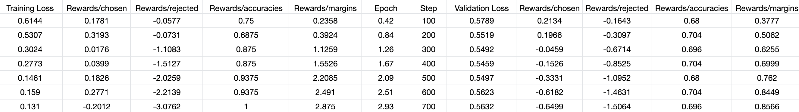
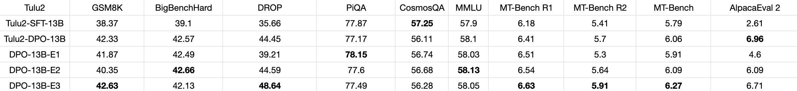
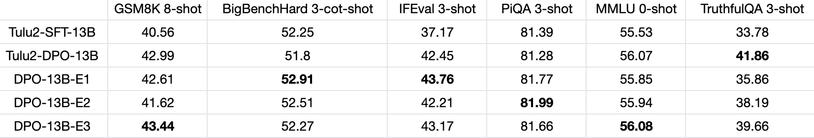

# LLM_DPO
General DPO scripts for LLMs.

## Environment
We provide [core_requirement.txt](core_requirement.txt) for your convenience.

## Settings
We tested with [tulu2 models](https://huggingface.co/collections/allenai/tulu-v2-suite-6551b56e743e6349aab45101), [Llama2 models](https://huggingface.co/meta-llama), [Qwen models](https://huggingface.co/Qwen)(1.0 version not 1.5) and [Baichuan2 Models](https://huggingface.co/baichuan-inc) with up to 100k instructions. Our environment is 900G CPU RAM and 8 x A800 80G GPUs for every computing node. We use [flashattention2](https://github.com/Dao-AILab/flash-attention) and [deepspeed](https://github.com/microsoft/DeepSpeed/tree/master) for faster training. The following hyperparameters were used during DPO training:
- dpo beta: 0.1
- max_length: 8192 (dynamic padding to the max data length)
- learning_rate: 1e-06 * sqrt(Num_of_Nodes)
- total_train_batch_size: 128 * Num_of_Nodes
- optimizer: AdamW with default values
- lr_scheduler_type: linear
- lr_scheduler_warmup_ratio: 0.1
- Weight Decay: 0.0
- num_epochs: 3.0
- Specifically add Tulu2 input format over training samples, see [here](https://huggingface.co/Junrulu/Reproduced-tulu2-dpo-13b#input-format)

We use 2 nodes to fine-tune [tulu2-13b](https://huggingface.co/allenai/tulu-2-13b) over 61k [ultrafeedback](https://huggingface.co/datasets/HuggingFaceH4/ultrafeedback_binarized) data with DPO algorithms for 3 epochs. It takes 613.41G CPU RAM, reaching 93.01% GPU utilities and consuming 32 hours. We release our model [here](https://huggingface.co/Junrulu/Reproduced-tulu2-dpo-13b).

## Workflow
`RootPath` is the absolute path of this repo.

### Instruction Tuning
Download raw models in [model](model) folder. Put your data in [data](data) folder. Run `bash code/scripts/tuning.sh 0 sigmoid RootPath`. 0 at $1 stands for full tuning, and sigmoid at $2 stands for dpo loss. Check the `tuning.sh` script for more details.

### Inference Testing
Please refer to the inference scripts in main branch.

## Experimental Results
We do reproducing experiments with [tulu2-13b](https://huggingface.co/allenai/tulu-2-13b) and [ultrafeedback](https://huggingface.co/datasets/HuggingFaceH4/ultrafeedback_binarized). 
- We obtains comparable progressive metrics: 
- Our final benchmark results (3 shots for first 6 capacity-focused datasets and are tested locally, while last 2 open-ended datasets are tested with GPT4-turbo), using [files](https://huggingface.co/datasets/Junrulu/Reproduced-tulu2-test-sets): 
- If we evaluate with benchmarks without chat template of tulu2, then it is better to fine-tune without chat template. For instance, fine-tune with raw ultrafeedback data and evaluate with [HF Eval Tool](https://github.com/EleutherAI/lm-evaluation-harness): 

## Acknowledgement
We thank aforementioned LLM projects for their great work.
